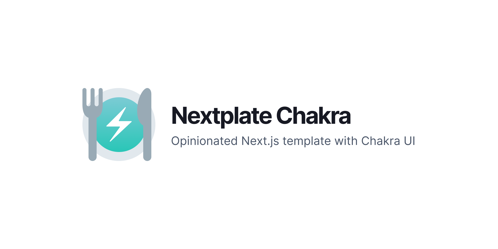

<!-- markdownlint-disable MD014 MD033 MD036 MD041 MD042 -->

<div align="center">



[Read the Nextplate docs on how to use this boilerplate (WIP)](#)

</div>

---

**Table of contents**

- [Use this template](#use-this-template)
  - [Using degit](#using-degit)
  - [Using GitHub templates](#using-github-templates)
- [Suggestions and/or questions](#suggestions-andor-questions)
- [Maintainers](#maintainers)
- [License](#license)

---

## Use this template

### Using degit

Create your new project using [degit](https://github.com/Rich-Harris/degit). This command will create a Nextplate Bare project in a new `my-awesome-project` directory:

```sh
npx degit kodingdotninja/nextplate-bare my-awesome-project
```

### Using GitHub templates

Click "Use This Template" on the project repository page, or [click here to create a new GitHub repository using this template](https://github.com/kodingdotninja/nextplate-bare/generate).

## Suggestions and/or questions

Head over to our [dedicated Discord channel for `nextplate` projects](https://discord.gg/WVdH7yyvj5).

## Maintainers

- Griko Nibras (@grikomsn)

## License

[MIT License, Copyright (c) 2021 Koding Ninja](./LICENSE)
